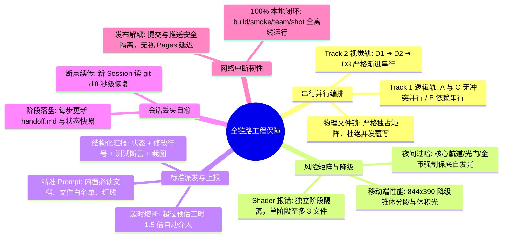
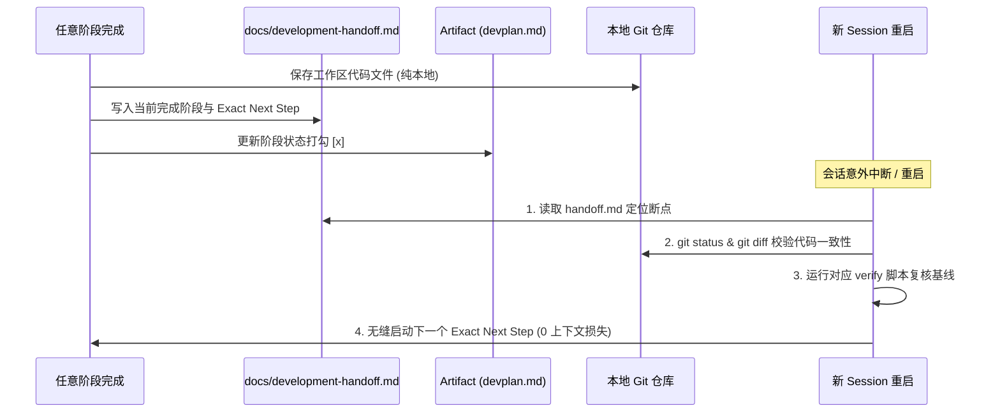

# Board Race 四大开发计划 v3.1 — 全链路韧性与渐进式交付架构

> 状态：**全阶段圆满交付** · 2026-08-31
> 架构目标：在彻底根除“黑夜单 Session 爆炸”与“Subagent 文件冲突”的基础上，补齐**串行并行编排、全维风险降级、标准上报派发、会话丢失自愈、网络中断韧性** 5 大工程保障体系。

---

## 一、系统韧性六维保障体系



---

## 二、串行 / 并行精确编排与文件锁

### 1. 执行编排矩阵

| 执行流 | 任务 | 模式 | 依赖条件 | 修改文件边界 | 验证工具 |
|---|---|---|---|---|---|
| **Phase 1A** | Subagent-A（雾道 Bug 修复） | **并行** | 无，即刻启动 | `src/game/course.ts` (仅引导逻辑) | `verify:team` |
| **Phase 1C** | Subagent-C（方向判定重构） | **并行** | 无，即刻启动 | `src/game/race.ts`, `src/hud/hud.ts` | `verify:smoke` |
| **Phase 1B** | Subagent-B（飞毛腿慢镜与视角） | **串行** | 等待 1A 与 1C 完成 | `duoInteraction.ts`, `boat.ts`, `chaseCamera.ts`, `duoViewportHud.*`, `main.ts` | `verify:team` + `verify:collision` |
| **Phase D1** | 视觉 D1（日夜底座与天空海洋） | **串行** | Track 1 全量验收封板 | `timeOfDay.ts`, `nightPalette.ts`, `sky.ts`, `ocean.ts` (底色), `main.ts` | `verify:smoke` + 截图评审 1 |
| **Phase D2** | 视觉 D2（灯塔光锥与生物尾迹） | **串行** | 截图 1 评审通过 | `lighthouse.ts`, `ocean.ts` (尾迹), `toonMaterial.ts`, `postPipeline.ts` | `verify:smoke` + 截图评审 2 |
| **Phase D3** | 视觉 D3（赛道发光与移动端） | **串行** | 截图 2 评审通过 | `course.ts` (发光材质), `coinVisual.ts`, `main.ts` | `verify:smoke` + `verify:team` + 截图 3 |

### 2. 绝对文件锁（File Locking Matrix）

```text
[src/game/course.ts]       ──> Phase 1A (引导函数) ──[释放]──> Phase D3 (材质发光)
[src/game/race.ts]         ──> Phase 1C 独占
[src/hud/hud.ts]           ──> Phase 1C 独占
[src/game/boat.ts]         ──> Phase 1B 独占 (applyScudHit)
[src/game/chaseCamera.ts]  ──> Phase 1B 独占
[src/game/duoInteraction]  ──> Phase 1B 独占
[src/hud/duoViewportHud.*] ──> Phase 1B 独占
[src/core/timeOfDay.ts]    ──> Phase D1 新建独占
[src/core/nightPalette.ts] ──> Phase D1 新建独占
[src/cel/sky.ts]           ──> Phase D1 独占
[src/water/lighthouse.ts]  ──> Phase D2 独占
[src/cel/toonMaterial.ts]  ──> Phase D2 独占
[src/cel/postPipeline.ts]  ──> Phase D2 独占
[src/game/coinVisual.ts]   ──> Phase D3 独占
[src/main.ts]              ──> Phase 1B ──[释放]──> Phase D1 ──[释放]──> Phase D3
```

---

## 三、全维风险矩阵与降级预案

| 风险项 | 严重级 | 触发条件 | 预防措施 | 兜底降级方案 |
|---|:---:|---|---|---|
| **夜间画面过暗（不可读）** | 🔴 高 | 天空与水面调色板压低后，赛道/浮标/金币不可见 | Phase D3 引入 `EMISSIVE_FLOOR` 常量，绿色主线与雾门独立自发光 | 强制将赛道 ribbon、门框柱体与金币的 `emissiveIntensity` 上调 1.8x，即使完全无光环境依然清晰可辨 |
| **Shader 编译错误/上下文膨胀** | 🔴 高 | 单次在 GLSL 字符串中写入大量复杂逻辑，调试反复报错 | 将 Shader 拆分至 D1（天空）、D2（海面与灯塔），单 Agent 仅触碰 1 个核心 Shader | 若 Subagent 连续 2 次 Shader 报错未解决，总司令直接提取精准 GLSL 补丁写入并替换 |
| **移动端 (844x390) 掉帧/卡顿** | 🟡 中 | 灯塔体积光（ConeGeometry）或海面生物荧光增加 Draw Call / Overdraw | 遵循 `ocean.ts` 原生 LOD 原则，灯塔光锥在移动端降级 | 移动端（`RenderQualityMode !== 'high'`）将 Cone 分段减半并关闭后处理 Bloom 增强 |
| **物理手感与 60Hz 合同回归** | 🔴 高 | `boat.ts` 引入飞毛腿 720° 翻滚影响正常行驶物理 | 翻滚只在 `applyScudHit` 的独立 timer 生效，不改动 `BoatInput` 与核心刚体积分 | 运行 `npm run verify:collision` 进行动力学回归断言，若有偏差立即撤回 |
| **双人模式 Final 状态冲突** | 🟡 中 | 修复雾道时误伤已完赛船只的 Final 穿越资格 | 严格遵循 `llmwiki.md` 第 135-142 行“合格不锁死”成就合同 | 运行 `npm run verify:team` 包含的 12 项双人模式专项断言进行回归 |

---

## 四、任务精准派发与标准上报协议

### 1. 派发规范（Dispatch Specification）

总司令启动 Subagent 时，统一使用内置 `self` 类型，并强制注入以下结构化指令：

```markdown
# 任务派发模板
- 角色定义: Board Race 专项工程师 ({任务名称})
- 必读上下文: AGENTS.md, docs/llmwiki.md, docs/development-handoff.md
- 独占文件白名单: [{指定文件列表}] (严禁修改名单外任何文件)
- 不可触碰红线: 60Hz 模拟、BoatInput 合同、单人模式行为、非指定模块
- 预期交付物: 代码变更、构建验证 (build + 对应 verify 脚本)、阶段汇报
```

### 2. 标准上报契约（Reporting Contract）

Subagent 任务结束或遭遇阻塞时，必须按以下格式发送结构化汇报：

```markdown
## Subagent 交付汇报
- **任务编号**: [例如 Phase 1A / Phase D1]
- **执行状态**: [SUCCESS / BLOCKED / ERROR]
- **修改文件列表**:
  - `src/xxx.ts`: L120-L145 (简述修改目的)
- **本地验证结果**:
  - `npm run build`: [PASS / FAIL]
  - `npm run verify:{smoke/team/collision}`: [PASS / FAIL]
- **截图附件** (仅视觉任务):
  - 截图路径: `/tmp/desktop-night.png`
- **卡点与问题** (若 BLOCKED):
  - 具体报错信息与已尝试的 1~2 种解法
```

### 3. 卡死熔断与干预规则
- **超时保护**：若 Subagent 运行超过预估工时 1.5 倍未产生有效进展，主 Agent 发送指令询问当前状态。
- **死锁熔断**：若 Subagent 在同一文件同一报错上反复循环修改超过 2 次，主 Agent 立即调用 `kill` 终止，由主 Agent 亲自修复该代码段后继续推进下一任务。

---

## 五、会话丢失与断点自愈机制 (Session Loss & State Recovery)

针对可能发生的**浏览器刷新、IDE 重启、上下文窗口意外断开**，制定 100% 状态恢复机制：



### 自愈恢复 SOP：
1. **持久化锚点**：每个 Subagent 完成并经验证后，主 Agent 第一时间将进度写入 `docs/development-handoff.md` 的 `当前工作包` 与 `唯一下一步` 字段。
2. **状态判定**：新 Session 接入时，只需运行 `git status` + `git diff`，对比 `development-handoff.md`，即可在 10 秒内恢复全部上下文与进度真相，直接启动下一阶段。

---

## 六、网络中断与离线韧性保障 (Offline Resilience)

1. **100% 本地离线验证闭环**：
   - `npm run build`（TypeScript 编译器 + Vite 打包）
   - `npm run verify:smoke`（本地 Puppeteer 无头浏览器运行）
   - `npm run verify:team`（本地双人模式全套用例）
   - `npm run verify:collision` / `verify:audio`（本地物理与音频诊断）
   - `npm run shot`（本地页面截图捕获）
   - **结论**：所有代码编写、调试、验证、截图全流程 **100% 本地离线执行，对外部网络 0 依赖**。
2. **发布与外网解耦**：
   - 最终发布命令 `npm run release:checked -- "..."` 采用本地预检模式，内部包含 `--no-wait-pages`。
   - 若遇到外网 GitHub 连通性波动导致 `git push` 超时，本地代码提交（commit）、构建产物与 handoff 文档均已在本地 git 树中安全落盘。网络恢复后只需执行一次 `git push origin main` 即可完成同步。

---

## 七、全流程交付阶段检查表

- [x] **Track 1 玩法与逻辑轨**
  - [x] **Phase 1A**: 雾道 Bug 修复 (`src/game/course.ts`) ➔ `verify:team` PASS
  - [x] **Phase 1C**: 方向判定重设计 (`src/game/race.ts` + `hud.ts`) ➔ `verify:smoke` PASS
  - [x] **Phase 1B**: 飞毛腿慢镜与导弹视角 (`duoInteraction.ts` + `boat.ts` + `chaseCamera.ts` + `duoViewportHud.*` + `main.ts`) ➔ `verify:team` + `verify:collision` PASS
- [x] **Track 2 日夜循环视觉轨**
  - [x] **Phase D1**: 日夜核心光照与天空海面底座 ➔ 截图评审 1 (桌面/手机底色)
  - [x] **Phase D2**: 灯塔旋转光锥与生物尾迹 ➔ 截图评审 2 (灯塔光锥对比)
  - [x] **Phase D3**: 赛道航道自发光与移动端安全 ➔ 截图评审 3 (844x390 终验)
- [x] **全量发布门禁**
  - [x] `npm run build && npm run verify:smoke && npm run verify:team`
  - [x] `jiepi-clear` 轻量预检
  - [x] 更新 `docs/development-handoff.md` 与 `docs/llmwiki.md`
  - [x] `npm run release:checked` 推送发布
